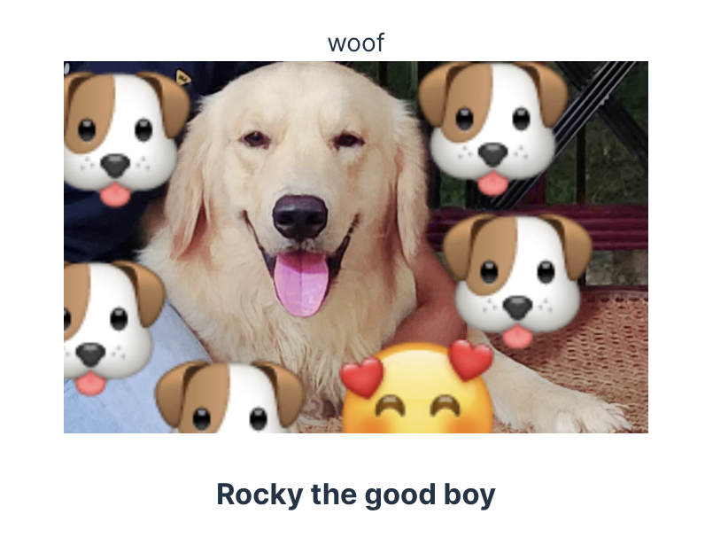

# This is test project for creating a react component library using [react-lib-starter](https://github.com/bytemebaby/react-lib-starter)

### Installation

```bash
pnpm i @bytemebaby/test-rls
# or
npm i @bytemebaby/test-rls
# or
yarn add @bytemebaby/test-rls
```

### Usage

```jsx
import { Woof } from "./lib/woof";
import "./App.css";
import { Rocky } from "./lib/rocky";

function App() {
  return (
    <>
      <Woof />
      <Rocky />
    </>
  );
}

export default App;
```


